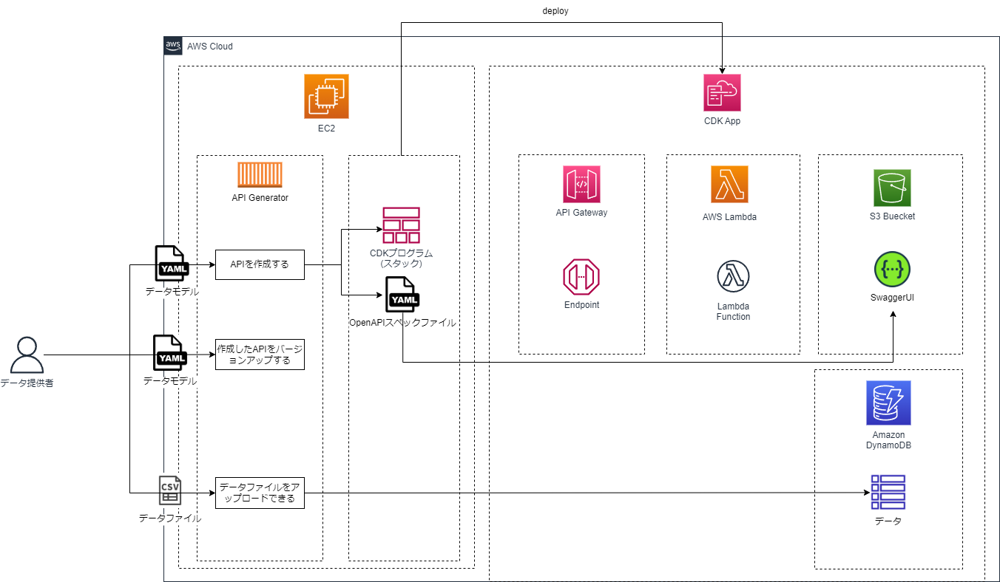
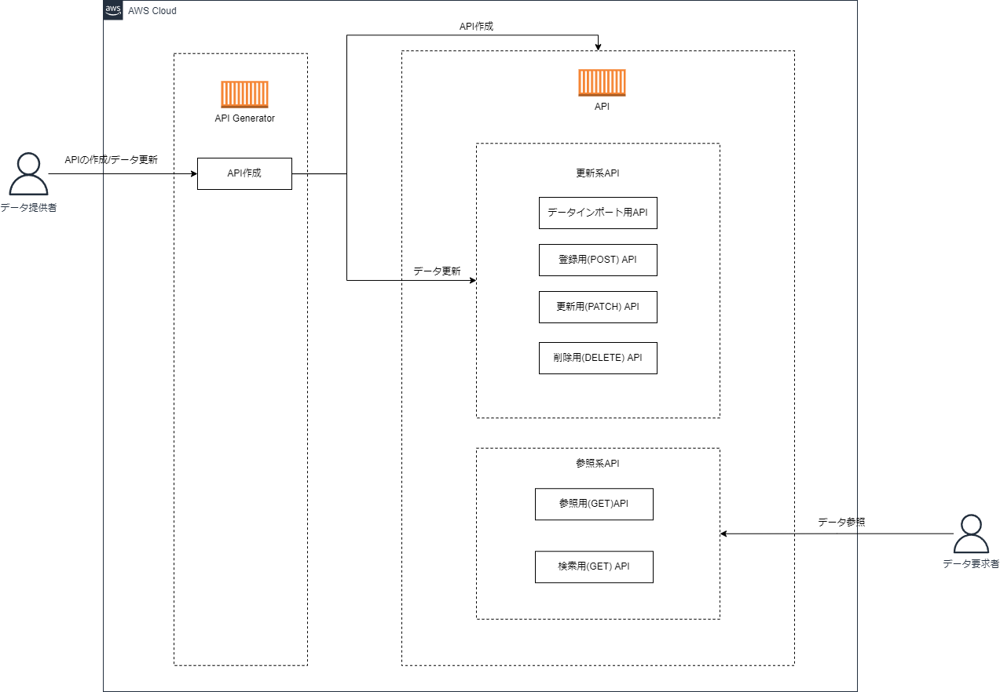
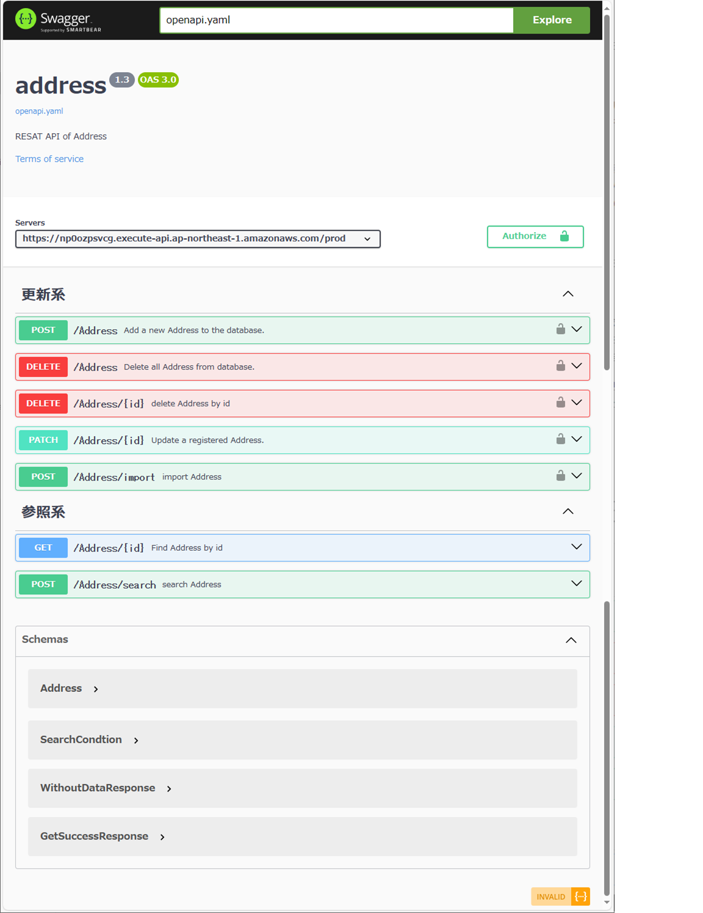

# Api Generator

## 1. Api Generatorについて

### 1.1. プロダクト概要
本ツールは、DynamoDBに格納するデータモデルをyaml形式で作成し、その設計を基にサーバレスアーキテクチャ（API Gateway、Lambda、DynamoDBを含む）上で動作するREST APIをAWS Cloud Development Kit (CDK) を用いて自動生成します。
さらに、生成されたAPIに対応するOpenAPI (Swagger) スペックファイルを作成し、SwaggerUIを構築してAPIのシミュレーションが可能になります。

本ツールでREST APIを作成することにより以下のメリットを得ることができます。
* データモデルからREST APIまでを一貫して設計・開発することができ、開発プロセスを大幅に削減します。
* サーバ管理の負担を減らし、コスト効率良くスケーラブルなアプリケーションを構築できます。
* OpenAPIスペックとSwaggerUIを利用することで、APIのドキュメンテーション作成とエンドポイントのテストが簡単になります。


### 1.2. 主な機能

<div align="center">

</div>

主な機能を以下に示します。

1. **データモデル設計**:
   - Yaml形式でREST APIのレスポンスおよびDynamoDBに格納されるデータモデルを設計します。
   - データ型、キー属性、インデックスなどの定義が可能です。

2. **CDKプログラムの自動生成**:
   - 上記のyaml設計をインプットとして、API Gateway、Lambda、DynamoDBを組み合わせたサーバレスREST APIのCDKプログラムを生成します。
   - インフラストラクチャ as Code (IaC) のアプローチを採用し、デプロイプロセスを自動化します。

3. **OpenAPI (Swagger) スペックファイルの生成**:
   - 生成されたREST APIに対応するOpenAPI (Swagger) スペックファイルを作成します。
   - APIのエンドポイント、リクエスト/レスポンスの形式などが記載されます。

4. **SwaggerUIの構築**:
   - 生成したOpenAPIスペックファイルをもとにSwaggerUIを構築します。
   - ブラウザ上で直感的にAPIの動作をシミュレートし、テストすることができます。

5. **データのライフサイクル管理**:
   - 大量データをインポートする場合、CSVファイルを指定しAPIを作成することができます。初期データをインポートしREST APIを作成できます。
   - 生成したAPIには更新系APIを具備しているため、追加・更新・削除APIによりデータを管理することができます。


### 1.4. 作成されるREST API

<div align="center">

</div>

Api Generatorにより生成されるREST APIを以下に示します。

| # | 更新/参照 | メソッド | API | 説明 |
| - | - | - | - | - |
| 1 | 更新 | POST | 登録用(POST)API | データモデルで定義したデータをPOSTしレコードを登録します。 |
| 2 | 更新 | PATCH | 更新用(POST)API | データモデルで定義したデータをPATCHしレコードを更新します。 |
| 3 | 更新 | DELETE | 削除用(DELETE)API | データモデルで定義したデータをキーを指定して削除します。 |
| 4 | 更新 | POST | インポート用(POST)API | データモデルで定義したデータをCSVでインポートします。複数のレコードのインポートが可能です。 |
| 5 | 参照 | GET | 参照用(GET)API | データモデルで定義したデータをキーを指定して参照します。 |
| 6 | 参照 | POST | 検索用(POST)API | データモデルで定義したデータを検索条件を指定して検索します。 |


### 1.5. 推奨環境
#### 1.5.1. 実行環境
| # | 実行環境 |
| - | - |
| 1 | Red Hat Enterprise Linux9 |
| 2 | Ubuntu Server 22.04 LTS |


## 2. インストール手順

### 2.1. 前提ライブラリのインストール
Api Generatorの前提ライブラリのAWS CLI、NodeJS、AWS CDKをインストールします。

#### 2.1.1. AWS CLIライブラリのインストール

```sh
curl "https://awscli.amazonaws.com/awscli-exe-linux-x86_64.zip" -o "awscliv2.zip"
unzip awscliv2.zip
sudo ./aws/install
```

#### 2.1.2. NodeJSのインストール

Node.js(20.11.1 <= version < 21.0.0)をインストールしてください。

* Red Hatの場合
```Shell
sudo yum install nodejs
```

* Ubuntu の場合
```Shell
sudo apt-get install nodejs
```
#### 2.1.3. AWS CDKライブラリのインストール

```sh
npm install -g aws-cdk
```


### 2.2. Api Generatorの取得

gitコマンドでgithubから Api Generatorのソースコードをクローンします。

```sh
git clone https://github.com/gbizconnect/api-generator.git
```

### 2.3. 依存ライブラリのインストール

npm installコマンドを実行して依存ライブラリをインストールします。

```sh
cd api-generator
npm install
```


### 2.4. cdk bootstrap実行

AWS CDKの使用を前提としています。 
AWS CDKを使用するには使用するAWSのアカウント環境で[CDK bootstrap](https://docs.aws.amazon.com/ja_jp/cdk/v2/guide/bootstrapping.html)コマンドを一度だけ実行する必要があります。

cdk bootstrapコマンドを実行します。
```sh
cdk bootstrap aws://ACCOUNT-NUMBER-1/REGION-1 aws://ACCOUNT-NUMBER-2/REGION-2 ...
```

以上でApi Generatorのインストールは完了です。

### 2.5. 依存ライブラリ

Api Generatorでは以下のライブラリを使用しています。


| # | 依存ライブラリ |
| - | - |
| 1 | @aws-sdk |
| 2 | @types/yargs |
| 3 | aws-sdk |
| 4 | axios |
| 5 | csv-parse |
| 6 | encoding-japanese |
| 7 | lambda-multipart-parser |
| 8 | mustache |
| 9 | replace-in-file |
| 10 | ts-node |
| 11 | yaml |


## 3. Api GeneratorツールでAPIを作成する

Api Generatorを用いてAPIを構築します。


### 3.1. モデルファイルの作成
Api Generatorへのインプットとなるモデルファイルを作成します。
以下フォーマットに従い、yaml形式で作成してください。

#### モデルファイルフォーマット

| 項目                                     | 説明                                                                                        | 必須 | 例                                              |
|----------------------------------------|---------------------------------------------------------------------------------------------|------|-------------------------------------------------|
| component:                             | root                                                                                        | Yes  | ー                                              |
| 　└ schemas:                           | スキーマを定義する 以下にモデルの配列を定義                                                 | Yes  | ー                                              |
| 　　└ {model_name}:                    | モデル名を定義する                                                                          | Yes  | Address, Category, User                         |
| 　　　├ properties:                    | モデルのプロパティを定義する。以下にプロパティの配列を定義する                              | Yes  |                                                 |
| 　　　│└ {property_name}:              | プロパティ名を定義する                                                                      | Yes  |                                                 |
| 　　　│　├ type:                       | 型を定義する JSON スキーマ仕様ドラフト 2020-12でサポートされている型に基づく                | Yes  | string, integer, number, boolean,  object, null |
| 　　　│　└ example:                    | 例を記載する SwaggerUIにて例が表示される                                                    |      |                                                 |
| 　　　└ keys:                          | 主キー(ハッシュキー、ソートキーを指定する)                                                  |      |                                                 |
| 　　　　　├ partition_key:             | プライマリキー(ハッシュキー)                                                                | Yes  | id, email, zip                                  |
| 　　　　　├ sort_key:                  | プライマリキー(ソートキー) partition_keyとsort_keyで一意のレコードになる必要がある。        |      | street,city,state                               |
| 　　　　　└ secondary_keys:            | DynamoDBのLSK、GSKを定義する                                                                |      |                                                 |
| 　　　　　　└ local_secondary_keys: [] | local_secondary_keyを設定する。 最大20個まで設定可能。                                      |      |                                                 |
| 　　　　　　　├  index_name:           | partition_key インデックス名はテーブルに対してい一意である必要がある 英数字記号(_)のみ許可  |      |                                                 |
| 　　　　　　　├  sort_key:             | sort_key  {property_name}から選択する必要がある                                             |      |                                                 |
| 　　　　　　└ global_secondary_keys:[] | global_secondary_keyを設定する。 最大20個まで設定可能。                                     |      |                                                 |
| 　　　　　　　├  index_name:           | インデックス名 インデックス名はテーブルに対してい一意である必要がある 英数字記号(_)のみ許可 |      |                                                 |
| 　　　　　　　├  partition_key:        | partition_key  {property_name}から選択する必要がある                                        |      |                                                 |
| 　　　　　　　└ sort_key:              | sort_key  {property_name}から選択する必要がある                                             |      |                                                 |


#### モデルファイルの作成例

```yaml
components:
  schemas:
    Address:
      type: object
      properties:
        - name: id
          type: integer
          example: 1001
        - name: username
          type: string
          example: 'the User'
        - name: phone
          type: string
          example: '12345'
        - name: city
          type: string
          example: '東京'
        - name: country
          type: string
          example: '日本'
        - name: email
          type: string
          example: 'sample@gmail.com'
        - name: memo
          type: string
          example: '取引先社員'
      keys:
        partition_key:
          name: id
        sort_key:
          name: username
        secondary_keys:
          global_secondary_keys:
            - index_name: email_index
              partition_key: email
          local_secondary_keys:
            - index_name: local_index
              sort_key: country
```

### 3.2. モデルファイルとコマンドオプションのチェック
checkオプションを使ってモデルファイルやid,passwordなどのチェックのみを行います。AWSにREST APIを構築しません。

```
npx ts-node src/main.ts -c -n Address -m sampleModel.yaml -v 1.0 -u -i basic-auth-id -p Pass-Word-01
```

### 3.3. APIの構築

checkオプションを使用してモデルファイルやid,passwordに問題がない場合、APIを構築してください。


実行例
```sh
# 実行コマンド
npx ts-node src/main.ts -n APIの名称 -m モデルファイル名 --api-version APIのバージョン -u -r -i ベーシック認証のID -p ベーシック認証のパスワード

# -u 更新系APIに認証をかけたAPI名称"Address" API Version 1.0のAPIを作成する
npx ts-node src/main.ts -c -n Address -m sampleModel.yaml -v 1.0 -u -i basic-auth-id -p Pass-Word-01
```

### 3.4. コマンドラインオプション
| オプション | オプション(省略形) | 型 | 必須 | 説明 |
| - | - | - | - | - |
| --aws-region | -a | string |  | AWSリージョンを設定してください。デフォルトで"ap-northeast-1"を設定します。 |
| --name | -n | string | 必須 | APIの名称を半角英数字記号(-) 30文字以内で入力してください。 |
| --model | -m | string | 必須 | モデルファイルを指定してください。 |
| --api-version | -v | string | 必須 | APIのバージョンを半角数字記号(.) 10文字以内で入力してください。 |
| --import-folder | -f | string |  | 初期インポートファイルを配置するフォルダを設定してください。 |
| --auth-update | -u | - |  | 更新系APIにBasic認証をかける場合、設定してください。 |
| --auth-ref | -r | - |  | 参照系APIにBasic認証をかける場合、設定してください。 |
| --id | -i | string |  | 更新系APIもしくは参照系APIにBasic認証をかける場合、Basic認証のIDを半角英数字記号(.@-_) 8文字以上で入力してください。  |
| --password | -p | string |  | 更新系APIもしくは参照系APIにBasic認証をかける場合、Basic認証のパスワードを半角英大文字、半角英小文字、半角数字、記号(.@-_*#$%=+:;!)を含む10文字以上16文字以内で入力してください。 |
| --check | -c | - |  | モデルファイルやid,passwordなどのチェックのみを行います。AWSにREST APIを構築しません。 |
| --contact |  | string |  | コンタクト情報(サポートページのURLやメールアドレス)を100文字以内で入力してください。Swagger-UIに出力されます。 |
| --terms |  | string |  | APIの利用規約(Terms Of Service)URL形式で100文字以内で入力してください。Swagger-UIに出力されます。 |
| --owner |  | string |  | APIのOwnerを100文字以内で入力してください。Swagger-UIに出力されます。 |
| --costsection |  | string |  | 費用負担部門を100文字以内で入力してください。Swagger-UIに出力されます。 |
| --license |  | string |  | ライセンス情報を100文字以内で入力してください。ライセンスページのURLも記述可能です。Swagger-UIに出力されます。  |
| --help |  | - |  | ヘルプを表示します。 |
| --version |  | - |  | ツールのバージョンを表示します。 |


### 3.5. API情報の参照
構築したAPIを参照します。

| オプション | オプション(省略形) | 型 | 必須 | 説明 |
| - | - | - | - | - |
| --name | -n | string |  | APIの名称を入力してください。 |
| --api-version | -v | string |  | APIのバージョンを入力してください。 |

```sh
# API名sampleapi, バージョン 1.0.0のAPI情報を参照する
npx ts-node api-ref.ts -n Address -v 1.0

# API名sampleapiのAPI情報を参照する
npx ts-node api-ref.ts -n Address

# 全てのAPI情報を参照する
npx ts-node api-ref.ts
```

以下各AWSリソースの情報が出力されます。
```json
{
  "api": {
    "Name": "address",
    "apiVersion": "1.0",
    "s3Bucket": {
      "Name": "s3bucketname-address-1-0",
      "ARN": "arn:aws:s3:::s3bucketname-address-1-0"
    },
    "SwaggerUi": {
      "Url": "https://xxxxx.s3bucketname-address-1-0.s3.ap-northeast-1.amazonaws.com/swaggerui/index.html"
    },
    "table": {
      "Name": "dynamodb-address-1-3",
      "ARN": "arn:aws:dynamodb:ap-northeast-1:xxxxxxxxxxxx:table/dynamodb-address-1-3"
    },
    "apigateway": {
      "Name": "restApi-address-1-3",
      "ARN": "arn:aws:apigateway:ap-northeast-1::/restapis/np0ozpsvcg",
      "Url": "https://np0ozpsvcg.execute-api.ap-northeast-1.amazonaws.com/prod"
    },
    "Lambda": {
      "authorizeFunc": {
        "Name": "authorizeLambda-address-1-3",
        "ARN": "arn:aws:lambda:ap-northeast-1:xxxxxxxxxxxx:function:authorizeLambda-address-1-3"
      },
      "deleteAllFunc": {
        "Name": "deleteAllLambda-address-1-3",
        "ARN": "arn:aws:lambda:ap-northeast-1:xxxxxxxxxxxx:function:deleteAllLambda-address-1-3"
      },
      "deleteRecordFunc": {
        "Name": "deleteRecordLambda-address-1-3",
        "ARN": "arn:aws:lambda:ap-northeast-1:xxxxxxxxxxxx:function:deleteRecordLambda-address-1-3"
      },
      "getRecordFunc": {
        "Name": "getRecordLambda-address-1-3",
        "ARN": "arn:aws:lambda:ap-northeast-1:xxxxxxxxxxxx:function:getRecordLambda-address-1-3"
      },
      "registerhFunc": {
        "Name": "registerLambda-address-1-3",
        "ARN": "arn:aws:lambda:ap-northeast-1:xxxxxxxxxxxx:function:registerLambda-address-1-3"
      },
      "searchFunc": {
        "Name": "searchLambda-address-1-3",
        "ARN": "arn:aws:lambda:ap-northeast-1:xxxxxxxxxxxx:function:searchLambda-address-1-3"
      },
      "updateRecordFunc": {
        "Name": "updateRecordLambda-address-1-3",
        "ARN": "arn:aws:lambda:ap-northeast-1:xxxxxxxxxxxx:function:updateRecordLambda-address-1-3"
      },
      "updateRecordsFunc": {
        "Name": "updateRecordsLambda-address-1-3",
        "ARN": "arn:aws:lambda:ap-northeast-1:xxxxxxxxxxxx:function:updateRecordsLambda-address-1-3"
      }
    }
  }
}
```


### 3.6. APIの削除
構築したAPIを削除します。

| オプション | オプション(省略形) | 型 | 必須 | 説明 |
| - | - | - | - | - |
| --name | -n | string | 必須 | APIの名称を入力してください。 |
| --api-version | -v | string | 必須 | APIのバージョンを入力してください。 |

```sh
npx ts-node destroy.ts -n APIの名称 -v APIドキュメントのバージョン

# API名sampleapi, バージョン1.0.0のAPIを削除する
npx ts-node destroy.ts -n sampleapi -v 1.0.0
```

## 4. APIを利用する

### 4.1. SwaggerUIの利用
#### SwaggerUIのURL
API情報の参照からAPI情報を参照し、api.SwaggerUi.Urlを確認してください。
ブラウザからURLにアクセスすることで、該当APIのSwaggerUIを参照することができます。
SwaggerUIを用いてブラウザ上でAPIのエンドポイントをテストすることができます。

<div align="center">

</div>


### 4.2. データを検索する

#### 検索フォーマット
参照系の検索APIを使用する場合は以下フォーマットのjsonをRequest BODYに設定してPOSTしてください。
```json
{
  "index_name": "{インデックス名}",
  "condition": "{検索条件}"
}
```

#### 検索条件の例:
インデックスemail_indexを指定してemail='sample@gmail.com'の条件のデータを検索する。
```json
{
  "index_name": "email_index",
  "condition": "email='sample@gmail.com'"
}
```

#### curlコマンドの例: 
```Shell
curl -X 'POST' \
  'https://xxxxxxxxxxxxxxxxxx.ap-northeast-1.amazonaws.com/prod/Address-1-0/search' \
  -H 'accept: */*' \
  -H 'Content-Type: application/json' \
  -d '{
  "index_name": "email_index",
  "condition": "email='\''sample@gmail.com'\''"
}'
```
#### 検索条件
検索条件のconditionにはPartiQL select ステートメントを利用できます。
詳細は[DynamoDB 用の PartiQL select ステートメントのドキュメント](https://docs.aws.amazon.com/ja_jp/amazondynamodb/latest/developerguide/ql-reference.select.html)を参照してください。


## 5. FAQ
* CDK bootstrapを実行すると、Resource handler returned message: "User: * is not authorized to perform: iam:PutRolePolicy on resource: role cdk-* with an explicit deny in
an identity-based policy (Service: Iam, Status Code: 403, Request ID: *)" (RequestToken: *, HandlerErrorCode: AccessDenied)  というエラーが発生します。
  * 適切なIAM PolicyをUserに付与してください。この場合は"iam:PutRolePolicy"が必要になります。


* cdk bootstrapを実行すると、SyntaxError: Unexpected token ?　というエラーが発生します。
  *   Nodejsのバージョンが古い可能性があります。Nodejsのバージョンを20にバージョンアップしてください。


* 検索条件を入力し検索用(POST)APIを実行するとレスポンスが返らずエラーになります。
  * DynamoDBから一度に取得できるデータサイズが1MBまでという制約があります。 1MB以上のデータを取得するにはページング処理が必要です。適切な条件を入力し、データサイズが1MB以下になるようクエリを設定してください。

* インポート用(POST)APIでCSVをアップロードするとタイムアウトしてしまう
  * インポート用(POST)APIはLambdaを使用し、データをDynamoDBにインポートしています。Lambdaは15分程度でタイムアウトしてしまうためAPIでCSVをインポートする場合は1万レコード目安にファイルを分割してインポートしてください。

* APIを作成するときに--import-folderオプションを指定し、大量データをインポートするときにタイムアウトエラーが発生する。
  * --import-folderに配置するファイルを100万レコードを目安に分割して配置してください。ファイルを分割し配置することでタイムアウトエラーがせずアップロードすることが可能です。

* APIの作成に失敗し、生成されたAWSサービスが破棄(CDKによりロールバック)されると、該当するバージョンが存在するというエラーが発生します。
  * APIの作成に失敗し、生成されたAWSサービスが破棄(CDKによりロールバック)されると該当バージョンのフォルダが残存し、該当バージョンのAPIを作成できなくなります。お手数ですが手動で該当バージョンのフォルダを削除してください。


## 6. ライセンス  
 本ソフトウェアは、[MITライセンス](LICENSE)の元提供されています。


## 7. 使用しているソフトウェアについて
使用しているソフトウェアのライセンスについては以下のドキュメントを参照してください。
* [included_licenses](included_licenses.md)
 

## 8. 免責事項

本製品（以下、「本ツール」という）は、Amazon Web Services（AWS）Cloud Development Kit（CDK）を使用してAWSのサービスを利用したREAT APIを構築するためのものです。本ツールを使用する前に、以下の免責事項をご確認ください。

1. 一般的な使用<br>
本ツールは、「現状有姿」で提供され、いかなる明示的または暗黙的な保証も伴いません。これには、商品性、特定目的への適合性、及び非侵害に関する保証が含まれますが、これに限定されません。本ツールの使用は完全にユーザーの自己責任において行われます。

2. AWSサービスの利用<br>
本ツールを使用して作成されたAWSリソースの管理、運用、および費用は、ユーザーの責任において行われます。AWSのサービス利用に関する費用や利用条件は、AWSの利用規約に準じます。本ツールは、AWSによるサービスの変更に伴い、予告なしに更新される場合があります。

3. 第三者のサービス<br>
本ツールが第三者のサービスやライブラリを使用する場合、それらのサービスの利用規約やライセンスに従う必要があります。本ツールは、これら第三者のサービスに関するいかなる保証も行いません。

4. 免責<br>
本ツールの使用によって生じた直接的、間接的、偶発的、特別、懲罰的、またはその他の損害に対して、本ツールの作者、貢献者、または関連する任意の当事者は責任を負わないものとします。これには、利益の損失、データの損失、業務の中断などが含まれますが、これに限定されません。

5. 改訂<br>
本免責事項は、予告なしに改訂される場合があります。本ツールを使用することで、ユーザーは本免責事項の最新版に拘束されることに同意したものとみなされます。
